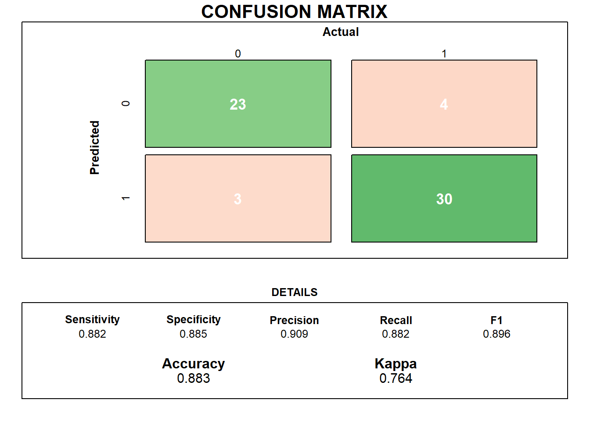

# Final Project
### Data Processing - 2019

**Authors:**

* Antoñanzas Martínez, Guillermo
* Burrell, David
* Pueblas Núñez, Rodrigo
* Martínez Capella, Ignacio

## Abstract

We have done some research in the most common causes of death in the United States over the years and we have compared it with Spain in an specific one (2017). Looking into the data, we have seen how significant the death rate from cardiovascular diseases is and we have done an analysis of a public Dataset to try to create  amodel that predict this kind of heart diseases.

## Introduction

During the exploration of the datasets, it was seen that a small number of diseases were the greatest contributers to the death of individuals. Taking inspiration from the referenced projects, the work below describes the process answering the question "Can it be predicted if a person has a heart disease?". If possible this early detection will improve patient quality of life, by allowing health care professionals take action before more serious symptoms occur. Additionally early action should help treatment be more effective and lower costs.

For inspiration, we have found the following articles and reports very interesting and helpful. 

* [Data Brief - Mortality in the United States](https://www.cdc.gov/nchs/products/databriefs/db328.htm)
* [Spain in numbers](https://www.ine.es/prodyser/espa_cifras/2018/34/)
* [Towards Data Science - Heart Disease Prediction
](https://towardsdatascience.com/heart-disease-prediction-73468d630cfc)
* [Improving the accuracy of prediction of heart disease risk based on ensemble classification techniques](https://www.sciencedirect.com/science/article/pii/S235291481830217X)
* [International application of a new probability algorithm for the diagnosis of coronary artery disease](https://www.sciencedirect.com/science/article/abs/pii/0002914989905249)
  
## Datasets used

* [USA Death causes dataset](https://catalog.data.gov/dataset/age-adjusted-death-rates-for-the-top-10-leading-causes-of-death-united-states-2013/resource/0e603f1d-31bf-4809-8f10-a994b305b379)
The data published by the Centers for Disease Control and Prevention was gathered by the National Center for Health Statistics (NCHS), with the last revision being made in 2017. This data set contains the information of the 10 leading causes of death in the United States. The data is based on information from resident death certificates filed in the 50 states and the District of Columbia using demographic and medical characteristics. The data set holds 10868 observations, each with the following 6 features:

  * **Year**: The year the sample was taken
  * **X113.Cause.Name**: Official labeled causes of death
  * **Cause.Name**: Simplified cause of death name
  * **State**: Name of the state the sample was taken. Inclues "United States" which is the total accross the entire country
  * **Deaths**: The number of deaths due to the cause in the state in the given year
  * **Age-adjusted-death-rate**: The death rate adjusted for the age range in the state the sample is from. The rates are per 100,000 population and based on the 2000 U.S. standard population.
  
* [Spain death causes Dataset](https://datos.gob.es/es/catalogo/ea0010587-defunciones-por-causas-lista-reducida-sexo-y-edad-nacional-estadistica-de-defunciones-segun-la-causa-de-muerte-identificador-api-t15-p417-a2017-l0-01001-px)
The second data set details the causes of death in Spain for the year 2017. It was found on the  government website, https://datos.gob.es/, although since the original project proposal is no longer available at the found location. This data was collected as  part of a study done by the Spanish Institute of Statistics (INE). Due to the layout of the data it was required to transform it so it could be processed. During this process the list of disease types were reduced by combining multiple of the same type to one so it was compared to the USA data set. An example of this is the Spanish data set has 30 types of cancer listed, while the USA set has 1, so the totals for the Spanish set were totaled under the name “Cancer”. The resulting data consists of 1056 observations with the following 4 features:

	* **DISEASE**: Name of cause of death
	* **GENDER**: The genender of the people represented by the observation, includes Males, Females and Both (total of both males and females)
	* **AGE**: The age range of the people who died in the observation
	* **NUMBER.OF.DEATHS**: The number of people that died

* [Heart Diseases UCI](https://www.kaggle.com/ronitf/heart-disease-uci) 
This dataset contains 14 attributes, taken from the Cleveland database, which contains up to 76 features in total. Each row contains the observations taken from the tests done on one patient who may or not suffer from a cardiovascular disease, which is also specified.
In total we have 303 observations, supposedly without any null values. Some of the attributes are:

  * **Sex**: It's the gender of the individual. (0 = Female, 1 = Male)
  * **Age**: Shows the age of the individual.
  * **CP**: Chest pain type experienced by the individual. (1 = typical angina, 2 = atypical angina, 3 = non-anginal pain, 4 = asymptomatic)
  * **Thalach**: Max heart rate achieved
  * **Target**: Diagnosis of heart disease (angiographic disease status)
  
## Exploratory data analysis

This part of the project can be found [here](https://rguitar96.github.io/data-processes-2019/final-project/analysis). We have created a separated file to make this one more readable. However, we will add here the most important graphics and conclusions.

[INTRODUCE SOME OF THE GRAPHS, INCLUDING THE LAST ONE OF HEART DISEASES]

One of the first and most important parts of this section of the project was to do a god visualization of the data we had gathered, so we spent some time building a set of good looking graphs that would help us better comprehend what we were talking about. Some of this plots are the following: 

**Data from the American dataset** 

**Data from the Spanish dataset** 

We soon found out that for both countries, one of the top death causes was Cardiovascular Disease, so we decided to focus our atention for the next part in this matter. 

Whilst working with all the data, we started to test and created a small visualization tool to see the death count for the USA data divided in states and in the different causes.

<iframe src="https://rguitar96.shinyapps.io/shiny-test/" style="border: 0px solid #AAA; height: 500px" width="100%"></iframe>

## Heart Disease prediction

Once again we have separated the test results from this part to a separate report. 

We analyzed the dataset and found that, as expected, it had the same data structure as the previous reports, that the female demographic was affected more by cardiovascular diseases.

The next part was analyzing the variables in the model to see which ones were more correlated both to the Target varible and to other ones, so we created this Correlation Matirx.

For the model, we tested some different methods, like Linear Models, k-Nearest Neighbor, Multi-layered perceptron and Decission Tree. After the training and testing was done and we got the results of all the posible hyperparameter combinations, we got the best model and its results:

We think that this model did a good job of predicting the Target vaiable and is fitting this context.

## Discussion and Future Work

[TO DO]

  - An analysis of the real world implications of the results, at least one full paragraph (**5 points**)
  - Clear suggestion for directions of future research, at least one full paragraph (**5 points**)

