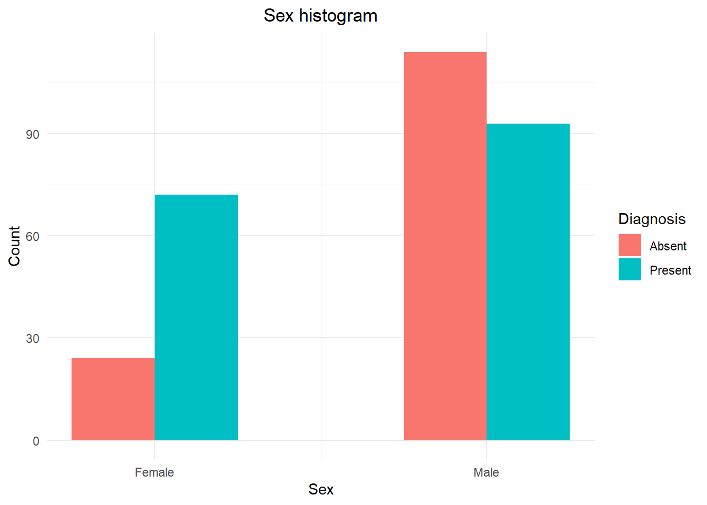

# Final Project
### Data Processing - 2019

**Authors:**

* Antoñanzas Martínez, Guillermo
* Burrell, David
* Pueblas Núñez, Rodrigo
* Martínez Capella, Ignacio

## Abstract

We have done some research in the most common causes of death in the United States over the years and we have compared it with Spain in an specific one (2017). Looking into the data, we have seen how significant the death rate from cardiovascular diseases is and we have done an analysis of a public Dataset to try to create  amodel that predict this kind of heart diseases.

## Introduction

The original purpose of this work was going to be the analysis of the most common causes of death in the USA, of their evolution over the years and if there were some differences between the USA and another country, being the chosen one Spain.

However, during the exploration of the datasets, it was seen that a small number of diseases were the greatest contributers to the death of individuals. Taking inspiration from the referenced projects, the work below also has the purpose of answering the question "Can it be predicted if a person has a heart disease?". If possible this early detection will improve patient quality of life, by allowing health care professionals take action before more serious symptoms occur. Additionally early action should help treatment be more effective and lower costs.

For inspiration, we have found the following articles and reports very interesting and helpful. 

* [Data Brief - Mortality in the United States](https://www.cdc.gov/nchs/products/databriefs/db328.htm)
* [Spain in numbers](https://www.ine.es/prodyser/espa_cifras/2018/34/)
* [Towards Data Science - Heart Disease Prediction
](https://towardsdatascience.com/heart-disease-prediction-73468d630cfc)
* [Improving the accuracy of prediction of heart disease risk based on ensemble classification techniques](https://www.sciencedirect.com/science/article/pii/S235291481830217X)
* [International application of a new probability algorithm for the diagnosis of coronary artery disease](https://www.sciencedirect.com/science/article/abs/pii/0002914989905249)
  
## Datasets used

* 
[USA Death causes dataset](https://catalog.data.gov/dataset/age-adjusted-death-rates-for-the-top-10-leading-causes-of-death-united-states-2013/resource/0e603f1d-31bf-4809-8f10-a994b305b379)
The data published by the Centers for Disease Control and Prevention was gathered by the National Center for Health Statistics (NCHS), with the last revision being made in 2017. This data set contains the information of the 10 leading causes of death in the United States. The data is based on information from resident death certificates filed in the 50 states and the District of Columbia using demographic and medical characteristics. The data set holds 10868 observations, each with the following 6 features:

  * **Year**: The year the sample was taken
  * **X113.Cause.Name**: Official labeled causes of death
  * **Cause.Name**: Simplified cause of death name
  * **State**: Name of the state the sample was taken. Inclues "United States" which is the total accross the entire country
  * **Deaths**: The number of deaths due to the cause in the state in the given year
  * **Age-adjusted-death-rate**: The death rate adjusted for the age range in the state the sample is from. The rates are per 100,000 population and based on the 2000 U.S. standard population.
  
* 
[Spain death causes Dataset](https://datos.gob.es/es/catalogo/ea0010587-defunciones-por-causas-lista-reducida-sexo-y-edad-nacional-estadistica-de-defunciones-segun-la-causa-de-muerte-identificador-api-t15-p417-a2017-l0-01001-px)
The second data set details the causes of death in Spain for the year 2017. It was found on the  government website, https://datos.gob.es/, although since the original project proposal is no longer available at the found location. This data was collected as  part of a study done by the Spanish Institute of Statistics (INE). Due to the layout of the data it was required to transform it so it could be processed. During this process the list of disease types were reduced by combining multiple of the same type to one so it was compared to the USA data set. An example of this is the Spanish data set has 30 types of cancer listed, while the USA set has 1, so the totals for the Spanish set were totaled under the name _Cancer_. The resulting data consists of 1056 observations with the following 4 features:

	* **DISEASE**: Name of cause of death
	* **GENDER**: The genender of the people represented by the observation, includes Males, Females and Both (total of both males and females)
	* **AGE**: The age range of the people who died in the observation
	* **NUMBER.OF.DEATHS**: The number of people that died

* 
[Heart Diseases UCI](https://www.kaggle.com/ronitf/heart-disease-uci) 
This dataset contains 14 attributes, taken from the Cleveland database, which contains up to 76 features in total. Each row contains the observations taken from the tests done on one patient who may or not suffer from a cardiovascular disease, which is also specified.
In total we have 303 observations, supposedly without any null values. Some of the attributes are:

  * **Sex**: It's the gender of the individual. (0 = Female, 1 = Male)
  * **Age**: Shows the age of the individual.
  * **CP**: Chest pain type experienced by the individual. (1 = typical angina, 2 = atypical angina, 3 = non-anginal pain, 4 = asymptomatic)
  * **Thalach**: Max heart rate achieved
  * **Target**: Diagnosis of heart disease (angiographic disease status)
  
    Also, we would like to thank the following researchers for the gathering of this dataset:
  
  1. Hungarian Institute of Cardiology. Budapest: Andras Janosi, M.D.
  2. University Hospital, Zurich, Switzerland: William Steinbrunn, M.D.
  3. University Hospital, Basel, Switzerland: Matthias Pfisterer, M.D.
  4. V.A. Medical Center, Long Beach and Cleveland Clinic Foundation:Robert Detrano, M.D., Ph.D.
  
## Exploratory data analysis

The first part of this work is concerned with the analysis of the USA and Spain death causes datasets. This part of the project, including the variable analysis, how the plots have been constructed and comments on the insights gathered,  can be found [here](https://rguitar96.github.io/data-processes-2019/final-project/analysis). We have created a separated file to make this one more readable. However, we will addto this report  the most important graphics and conclusions.

One of the first and most important parts of this section of the project was to do a god visualization of the data we had gathered, so we spent some time building a set of good looking graphs that would help us better comprehend what we were talking about. Some of this plots are the following: 

### Data from the American dataset

Whilst working with all the data, we started to test and created a small visualization tool to see the death count for the USA data divided in states and in the different causes.

<iframe src="https://rguitar96.shinyapps.io/shiny-test/" style="border: 0px solid #AAA; height: 700px" width="100%"></iframe>

### Data from the Spanish dataset

### Heart disease dataset

We soon found out that for both countries, one of the top death causes was Cardiovascular Disease, so we decided to focus our atention for the next part in this matter. The third dataset was used for this purpose. Once again we have separated the whole data analysis, which can be accessed [here](https://rguitar96.github.io/data-processes-2019/final-project/heart-disease-final), from this report. 

We analyzed the dataset and found that patterns found in the two previous ones appeared also in this one. For example, that the female demographic was more affected by cardiovascular diseases. 

## Methods

Given that cardiovascular diseases are so relevant, we decided to implement some algorithm able to predict if a person suffers one given the measurements present in the Heart Diseases UCI dataset. This section describes the process followed in order to develop this algorithm.

### Variable selection

The first step was to decide which variables were of interest. Our first approach was to obtain the Pearson correlation coefficient between the explanatory variables and the target one (presence or not of cardiovascular disease). We selected as potential variables of interest the following ones:

  * sex
  * cp
  * thalach
  * exang
  * oldpeak
  * slop
  * ca
  * thal
  * target

In order to confirm that the selected variables would be useful, we proceeded to construct a Linear Regression model. We started by one which included all the variables in an additive manner. The second model included all the interactions. The final model was constructed based on the significant variables and interactions. It  included all of the selected variables except _age_, which supported our decision.
 The formula used for the final Linear Regression model is: ftarget ~ sex + cp + thalach + exang + oldpeak + slope +  ca + thal + cp:ca + ca:thal + thalach:thal 

### Machine Learning algorithm
The next step was to test different machine learning algorithms able to predict the variable of interest. Three approaches were used:

  * k-Nearest Neighbors. Hyperparameters: number of nearest neighbors.
  * Multi-Layer Perceptron. Hyperparameters: size of the network.
  * Decision Tree. Hhyperparameters: use or not of pruning, and pruning confidence level.

They all employed the variables that passed the correlation and Linear Regression test and were normalised before being fed to the classifiers. The dataset was split in two parts, training and testing, with respective percentages of 80% and 20%. The training of the algorithms was done using a 5-fold cross-validation approach. Again, the reader is referred to this [analysis](https://rguitar96.github.io/data-processes-2019/final-project/heart-disease-final) for the full process of data normalization, training and testing data split, hyperparameter tuning and final model selection. 

## Results
### Variable selection

The variables fed to the machine learning algorithms have been selected using a statistical approach. First, the Pearson correlation coefficient between the explanatory variables and the target one was obtained. Variables selected based on this criteria were the same selected using a Linear Regression model. In the image below, the formula of the model, alongside the significance of the variables and their interactions (Pr(<|t|)) and their magnitude (coefficient). Variables/interactions with a p-value smaller than 0.05 are significant. Concerning the magnitudes, we can see that the stronger are the one of variables _ca_ and _thalach_ and of their respective interactions with _thal_. 

### Machine Learning algorithm

The model that yielded the best results was the Multilayer Perceptron. It had the highest precision score and also the lowest number of false negatives with the test data. The importance of sensibility is capital in medical contexts, where failing to detect a disease could lead to really bad consequences.

However, although we think that this model did a good job of predicting the target vaiable, it has the intrinsic problem that it is a black box. That is, it cannot be inferred how the Multi-Layer Perceptron classifies a patient, which is capital when taking medical decisions. Therefore, an algorithm with a clear rational behind its decisions, like the Decision Tree, could be used alongside the Multi-Layer Perceptron to support a clinical action. 

## Discussion and Future Work

An analyis of the top common death causes has been carried for the USA and for Spain. During the analysis, the authors were interested in predicting if a person could suffer from a cardiovascular disease. Several machine learning algorithms were tried, resulting in the selection of a Multi-Layer Perceptron as the most precise one. However, given that it is a black box and that decisions in medical contexts require of a strong rational supporting them, the Multi-Layer Perceptron should be backed by another algorithm, like a Decision Tree. 

#### Real world implications of the result.
  
Cardiovascular diseases are the number one cause of death globally, taking an estimated 17.9 million lives each year. Early detection is crucial to prevent these, but symptons are often looked over. Modeling an algorithm able to predict if a patient suffers or may suffer in the future heart disease would be a huge advantage for preventing harsh consequences. Our proposed solution, while not complex, aims to help medical personel to better treat their patients, therefore improving prevention and decreasing the death rate of this disease.
  

  
#### Future work
 
As we have seen, this was a good proof of concept, but the model lacks first loads of data. For future work, more complex datasets should be cross joint, and new complex models should be trained. On taking this approach to the real world, once this data is gathered and the model is trained, it could be given to professionals to help them on their day to day consultancy, and their feedback could be really valuable to adjust the acceptable thresholds of False Positives against False Negatives.

